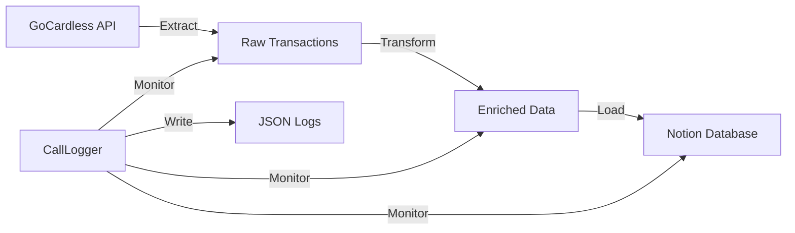

# API Backend Documentation

This directory contains the Python backend for the Broomfield Family Hub.

## Directory Structure

```
api/
├── banking_transactions/      # Transaction sync module
│   ├── __init__.py
│   ├── transaction_config.py       # Configuration and constants
│   ├── transaction_extract.py      # GoCardless API calls
│   ├── transaction_transform.py    # Data enrichment & categorization
│   ├── transaction_notion_adapter.py # Notion page creation
│   ├── transaction_logger.py       # Structured logging with CallLogger
│   ├── transaction_main.py         # Main orchestration script
│   └── email_notifications.py      # Email alerts and digests
│
├── notion_handlers/           # Generic Notion utilities
│   ├── notion_config.py       # API keys and database IDs
│   └── notion_loader.py       # Generic page creation
│
├── data/transactions/         # Transaction sync data
│   ├── logs/                  # Daily structured logs (JSON)
│   ├── summary.json           # Rolling stats summary
│   ├── config.json            # Cron schedule configuration
│   └── synced_transactions.json # Deduplication tracking
│
├── scripts/                   # Utility scripts
│   ├── run_transaction_sync.py # Manual sync trigger
│   ├── fetch_transactions.py   # Raw data fetcher (legacy)
│   └── enrich_and_upload.py    # Enrichment script (legacy)
│
├── endpoints/transactions/    # FastAPI endpoints
│   ├── sync_stats.py          # GET /api/transactions/stats
│   ├── sync_logs.py           # GET /api/transactions/logs
│   └── sync_config.py         # GET /api/transactions/config
│
└── main.py                    # FastAPI app entry point
```

## Transaction Sync Architecture

### ETL Pipeline



### Components

#### 1. Extract (`transaction_extract.py`)
- Fetches raw transaction data from GoCardless
- Handles rate limiting and retries
- Manages metadata and sync tracking files
- Filters accounts based on sync enabled flag

#### 2. Transform (`transaction_transform.py`)
- Enriches transactions with:
  - Categorization (Bills, Income, Spending, etc.)
  - Icon assignment per category
  - Cardholder detection for credit cards
  - Text formatting (camel case)
- Uses pattern matching and keyword detection

#### 3. Load (`transaction_notion_adapter.py`)
- Maps enriched data to Notion properties
- Routes transactions to correct databases (Personal, Business, Children)
- Handles page creation with icons
- Updates existing pages when status changes

#### 4. Orchestration (`transaction_main.py`)
- Coordinates the full ETL pipeline
- Integrates CallLogger for structured logging
- Sends email notifications on errors
- Supports dry-run and test data modes

#### 5. Logging (`transaction_logger.py`)
- Creates detailed JSON logs for each sync run
- Captures all API calls (GoCardless + Notion)
- Stores request/response data (truncated for size)
- Generates daily and summary statistics

### Configuration

Edit `api/data/transactions/config.json`:

```json
{
  "cron_schedule": "0 */6 * * *",
  "cron_description": "4 times daily at 00:00, 06:00, 12:00, 18:00 UTC",
  "enabled_accounts": [
    "account_id_1",
    "account_id_2"
  ],
  "next_run_times": [...],
  "timezone": "Europe/London",
  "log_retention_days": 90
}
```

### Email Notifications

Configure in `.env`:

```bash
# SMTP Settings
SMTP_HOST="smtp.gmail.com"
SMTP_PORT="587"
SMTP_USERNAME="your_email@gmail.com"
SMTP_PASSWORD="your_app_password"
SMTP_FROM_EMAIL="your_email@gmail.com"
SMTP_TO_EMAIL="notification_email@gmail.com"

# Notification Preferences
EMAIL_NOTIFICATIONS_ENABLED="true"
EMAIL_IMMEDIATE_ERRORS="true"
EMAIL_DAILY_DIGEST="true"
EMAIL_DAILY_DIGEST_TIME="18:00"
```

## Running Transaction Sync

### Manual Run

```bash
# Full sync
python api/scripts/run_transaction_sync.py

# Dry run (don't create Notion pages)
python api/scripts/run_transaction_sync.py --dry-run

# Specific account only
python api/scripts/run_transaction_sync.py --account-id acc_xyz123

# Test with sample data
python api/scripts/run_transaction_sync.py --test-data api/TEMP/gcResponses/transactions_curr.json --dry-run
```

### Cron Job Setup

On your NAS (QNAP/Synology):

```bash
# Edit crontab
crontab -e

# Add sync job (runs every 6 hours)
0 */6 * * * cd /path/to/project && /usr/bin/python3 api/scripts/run_transaction_sync.py >> /path/to/logs/cron.log 2>&1
```

## API Endpoints

The FastAPI server provides REST endpoints for the frontend dashboard.

### GET /api/transactions/stats

Returns summary statistics:

```json
{
  "today": {
    "date": "2025-01-16",
    "total_transactions": 87,
    "successful_runs": 3,
    "failed_runs": 0,
    "last_run": "2025-01-16T22:55:42Z",
    "next_run": "2025-01-17T00:00:00Z",
    "duration_ms": 3240
  },
  "active_accounts": 4,
  "last_7_days_success_rate": 0.96
}
```

### GET /api/transactions/logs?date=YYYY-MM-DD&limit=20

Returns structured log entries:

```json
[
  {
    "run_id": "run_1737014100",
    "timestamp": "2025-01-16T22:55:42Z",
    "status": "success",
    "duration_ms": 2340,
    "accounts_processed": [
      {
        "account_id": "acc_starling_8246",
        "owner": "Anthony",
        "institution_name": "Starling",
        "last_four": "8246",
        "calls": [...],
        "summary": {
          "fetched": 17,
          "new": 15,
          "updated": 2,
          "skipped": 0,
          "errors": 0
        }
      }
    ]
  }
]
```

### GET /api/transactions/config

Returns sync configuration and schedule.

## Troubleshooting

### Rate Limiting

GoCardless has rate limits:
- 180 requests per minute per account
- The system handles 429 errors gracefully
- Failed accounts will retry on next sync

### Duplicate Transactions

The system tracks synced transactions in `synced_transactions.json`:
- Prevents creating duplicate Notion pages
- Updates existing pages if status changes (pending → booked)

### View Logs

```bash
# Today's logs
cat api/data/transactions/logs/2025-01-16.json | jq

# Summary statistics
cat api/data/transactions/summary.json | jq

# Latest run from summary
cat api/data/transactions/summary.json | jq '.last_run'
```

### Test Connection

```bash
# Test GoCardless API
python -c "from banking_data.gc_client import get_nordigen_client; print(get_nordigen_client())"

# Test Notion API
python -c "from notion_handlers.notion_loader import get_notion_client; print(get_notion_client())"
```

## Development

### Adding New Categories

Edit `transaction_transform.py`:

1. Add icon URL to `CATEGORY_ICONS`
2. Add merchant pattern to `EXACT_MERCHANT_MAP` or `KEYWORD_PATTERNS`
3. Test with dry-run

### Custom Enrichment

Add new enrichment logic in `transform_transaction()` function.

### Notion Property Changes

Update `map_transaction_to_notion_properties()` in `transaction_notion_adapter.py`.

## Dependencies

Install Python requirements:

```bash
pip install -r api/requirements.txt
```

Key dependencies:
- `nordigen` - GoCardless client
- `notion-client` - Notion API
- `python-dotenv` - Environment variables
- `fastapi` - REST API framework
